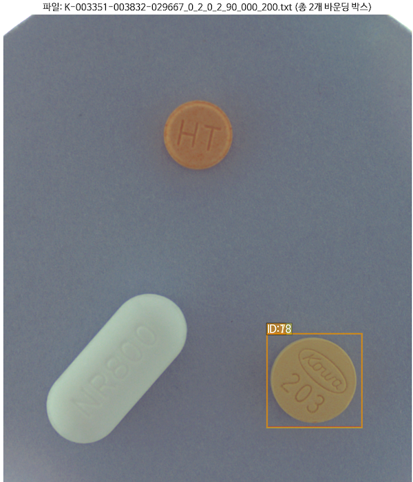
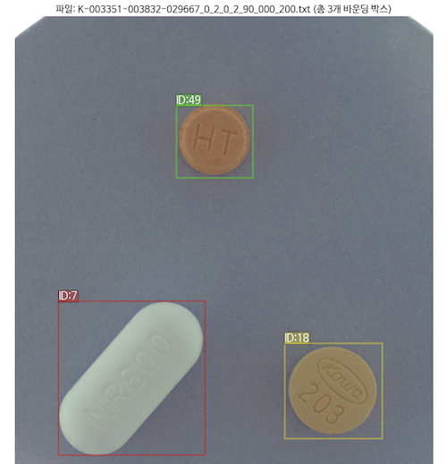

# 📝  프로젝트 일지


## [Rot1] faster R-CNN 

- 팀원 각자 다른 객체 인식 모델을 만들어보고 성능비교를 통해 최종 모델을 선정하는 방식을 채택

### 모델링 결과 
- 배치 16, 에폭 35, 학습률 0.0001, 백본- 레즈넷50, 이미지 리사이즈-224
    ```
    학습 Epoch 35: 100%|██████████| 75/75 [03:59<00:00,  3.19s/it, loss=0.741, avg_loss=0.781]
    검증 Epoch 35: 100%|██████████| 19/19 [00:25<00:00,  1.34s/it]
    ===== 검증 결과 (에포크 35) =====
    mAP (IoU=0.75:0.95): 0.0367
    mAP (소형 객체): -1.0000
    mAP (중형 객체): -1.0000
    mAP (대형 객체): 0.0884
    =============================
    ```
    
    
    - 객체 인식은 어느정도 하는것 같은데 클래스 맞춘게 딱 1개밖에 없다. 다른 예측들도 마찬가지인 수준
    - 신뢰도 점수들도, map 점수도 엄청 낮다

<br>

### 알게 된 점
- faster RCNN은 배경 클래스인 0번을 따로 넣어줘야함
- 즉, 진짜 클래스는 1번 부터 시작해야함
- 클래스 매핑을 원래 클래스 고유 번호가 아닌 인덱스(0부터 시작하여 순차적인 숫자) 번호로 넣어줘야함
- 증강 적용할 때 바운딩박스도 같이 적용할 수 있게 주의해야한다(크기, 회전 등)
- 바운딩 박스가 이미지 영역을 벗어나면 모델 학습 중 오류가 난다
- `albumentations` 라이브러리를 사용했는데 좌표가 계속 틀어지는 오류가 발생함
- 메모리 관리의 중요성. 강의 시간에는 배치를 20,30으로 두고해도 괜찮아서 배치 사이즈를 16으로 했더니 1에폭당 GPU 12~14기가를 먹어서 계속 가비지 컬렉션을 실행하고 학습이 중단됐다.

<br>

### 인사이트
- 증강 적용 후 시각화 하는 과정에서 좌표가 잘못된 바운딩 박스 발견 > bbox 전처리의 필요성 느낌
    
- 어노테이션 디렉토리 구조 파악
    - 이미지 파일의 이름에 있는 숫자 묶음은 알약의 (id+1) 값이고
    - 숫자 묶음의 개수를 통해 이미지 안에 객체(알약) 개수를 알 수 있다.
    - 같은 알약 묶음이 카메라 각도별(70,75,90)로 주어져 있다.
    - 하나의 json 파일에 한 객체(알약)의 정보가 들어있다. 
        - 이미지와 어노테이션 파일간의 일대다 대응 관계
    - json 파일은 누락되어 있을 수 있고, K-폴더 자체가 누락되어 있을 수 있다.
    ```
    📁 train_images/
    ├── 📄 K-000001-000002-000003_(생략)_70_(생략).png
    ├── 📄 K-000001-000002-000003_(생략)_75_(생략).png
    ├── 📄 K-000001-000002-000003_(생략)_90_(생략).png
    📁 train_annotations/
    ├── 📁 K-000001
    ├───── 📄 K-000001-000002-000003_(생략)_70_(생략).json
    ├───── 📄 K-000001-000002-000003_(생략)_75_(생략).json
    ├───── 📄 K-000001-000002-000003_(생략)_90_(생략).json
    ├── 📁 K-000002
    ├───── 📄 K-000001-000002-000003_(생략)_70_(생략).json
    ├───── 📄 K-000001-000002-000003_(생략)_75_(생략).json
    ├───── 📄 K-000001-000002-000003_(생략)_90_(생략).json
    ├── 📁 K-000003
    ├───── 📄 K-000001-000002-000003_(생략)_70_(생략).json
    ├───── 📄 K-000001-000002-000003_(생략)_75_(생략).json
    ├───── 📄 K-000001-000002-000003_(생략)_90_(생략).json
    ```


<br><br>


## [Rot2] YOLO 데이터 분석

- 제일 성능이 좋고 가벼운 YOLOv8과 YOLOv12로 최종 모델이 추려짐
- 다른 torchvision 모델들과 yolo 모델의 데이터셋의 구조가 다르다고 하셔서
- 현석님의 yolo 모델코드와 eda 노트북 파일을 base로 데이터 분석 및 eda 시작

<br>

### 알게된 점
- 바운딩박스 누락

- 클래스 불균형 
    - 그래프로 시각화로 확인까지 했지만, 어떻게 처리할지 감이 안왔다.
    - 예전에 segmentation 모델링 햇을때 가중치 곱한거 밖에 생각이 안났다.
- 바운딩 박스가 fasterRCNN은 `[x_min,y_min,x_max,y_max]`의 형식이엿는데 yolo는 `[x_center, y_center, width, height]` 형식
- yolo는 이미지 영역 벗어나는 바운딩박스의 오류를 알아서 예외처리 해준다.
- 배경 클래스 0번을 따로 빼줄 필요가 없다.

<br>

### 인사이트
- 총 7개의 어노테이션을 삭제하기로 함
    - 이미지 영역 벗어나는 bbox
        ```
        === 잘못된 형식의 레이블 (1개 발견) ===
        파일: K-003544-004543-012247-016551_0_2_0_2_70_000_200.txt, 라인: 1, 오류: [0, 0.7802254098360656, 7.029296875, 0.2223360655737705, 0.16953125]
        === 잘못된 형식의 레이블 (1개 발견) ===
        파일: K-003351-016262-018357_0_2_0_2_75_000_200.txt, 라인: 3, 오류: [65, 6.88780737704918, 0.611328125, 0.31864754098360654, 0.24609375]
        ```

    - 잘못된(=겹치는) bbox

    |파일명	삭제할 클래스| ID|
    |---|---|
    |K-001900-016548-019607-033009_0_2_0_2_70_000_200.txt|	1|
    |K-003351-018147-020238_0_2_0_2_90_000_200.txt|	14|
    |K-003351-003832-029667_0_2_0_2_90_000_200.txt|	52|
    |K-003351-029667-031863_0_2_0_2_70_000_200.txt|	24|
    |K-003351-020238-031863_0_2_0_2_70_000_200.txt|	14|


<br><br>

## [Rot3] YOLOv12 모델 auto_agument 실험

- 우리가 사용하는 `ultralytics`의 yolo 모델은 각각의 증강을 따로 적용하는 것보다는 `auto_augment` 파라미터를 적용하는게 가장 효과가 좋다는 의견이 나와서 3가지 옵션을 실험해서 점수 차이를 보기로 함
- bbox 데이터 전처리로 삭제를 선택했는데 강사님이 삭제보다는 수정을 권하셔서 수정을 하기로 했다. 
    - 하는김에 같은 이미지에 누락되어있는 bbox도 추가

<br>

### 모델링 결과

- bbox 전처리 후 auto_agment 모델링 실험
- 에폭30, 배치사이즈 4, lr=0.00013, 이미지 리사이즈 960

| auto_augment | mAP@[0.75:0.95] | kaggle 점수 | 비고 | 
| --- | --- | --- | --- |
| 전처리 전 | 0.86 | 0.96520 | |
| **randaugment** | 0.86 | 0.96650 | bbox 좌표수정 시 이미지의 가로,세로크기 반대로 입력함 |
| **autoaugment** | 0.86 | 0.96650 | bbox 좌표수정 시 이미지의 가로,세로크기 반대로 입력함 |
| **augmix** | 0.85 | ***0.96853*** | 검증 데이터의 mAP점수는 줄었지만, 캐글 점수는 가장 높았음 |


<br>

### 인사이트
- 전처리 좌표 삭제 > **수정**

    | 전처리 전 | 전처리 후 |
    | --- | --- | 
    |  |   |

- 예측 보니 같은 알약 비슷한 사진 구도에서 예측 못하는 경우 존재
    | test_images 1384.png  | test_images 1385.png |
    | --- | --- | 
    |  |   |

- auto_agment 파라미터 중 augmix가 가장 높은 점수가 나옴
- 로컬환경에서 window, mac os 간의 호환성 문제 꽤 많음
    - 심볼릭 링크 가상환경에서 만들 시 mac은 찾지 못하는 이슈 발생

<br>

### 생각해 본거
- 클래스 예측을 못해도 객체인식은 되어야 하는게 정상 아닌가?
- pseudo-labelling으로 누락된 .json 파일은 채웠는데 누락된 K-폴더는 어떻게 채워야 할까?
    - 근데 이미 K-폴더가 어떤 약제인지, 다른 객체들의 bbox의 좌표가 있으므로 어떤 위치에 대충 있을지 에상이 됨
    - 그라운딩 다이노로 박스 예측은 가능하다는 강사님의 조언


<br><br>

## [Rot4] 데이터셋 확장
- bbox 전처리 후 pseudo-labeling 정교화를 거쳐 캐글 점수 0.98304 까지 오름
- 가장 높은 점수가 나왔던 모델의 예측 결과를 보니 아직도 객체 인식을 못하는 알약이 있길래 검색해보니, 아예 **라벨 자체가 누락** 되어 있음 ex) 넥시움정
    - 
- ai hub 라벨 데이터를 보니 넥시움정 어노테이션이 있길래 수동으로 라벨을 추가하려다가 혹시 이런 경우가 더 있을까봐 **데이터셋을 추가** 하기로 함
<br>

### 인사이트
- 확장 후 최종 데이터 개수
    ```
    검사 결과 (폴더): # 어노테이션 폴더 
    - 중복 폴더 수: 0
    - 디렉토리1 고유 폴더 수: 616
    - 디렉토리2 고유 폴더 수: 61

    검사 결과 (파일): # 이미지 파일
    - 중복 파일 수: 0
    - 디렉토리1 고유 파일 수: 1842
    - 디렉토리2 고유 파일 수: 181
    ```
- 클래스수 변경: 74 > 85
    ```
    ===== 새로 추가된 클래스 목록 =====
    73: '넥시움정 40mg',
    74: '뮤코원캡슐(에르도스테인)',
    75: '알마겔정(알마게이트)(수출명:유한가스트라겔정)',
    76: '알바스테인캡슐(에르도스테인)',
    77: '엘스테인정(에르도스테인)',
    78: '베시케어정 10mg',
    79: '자트랄엑스엘정 10mg',
    80: '토비애즈서방정 4mg',
    81: '트루패스정 4mg',
    82: '플리바스정 50mg',
    83: '아보다트연질캡슐 0.5mg',
    84: '엘도스캡슐(에르도스테인)(수출용)'
    ```
- 데이터셋 확장 후 pseudo-labeling 까지 적용 kaggle 점수 `0.9904`로 오름
    - 그런데 submission.csv 행이 28,000행이 됐다... 


<br><br>


## [Dev] 데이터 전처리 및 submission파일 분석
- 확장된 데이터셋에 대해 전처리 진행
    - 이미지 영역 벗어난 바운딩박스: 총 9개
    - 겹치는 바운딩 박스: 총 35개
    - 어노테이션 파일명의 숫자묶음과, 파일 내용의 라인수 비교하여 찾은 누락된 바운딩 박스:  58개
- bbox 전처리는 `labelme`와 `label2yolo` 라이브러리를 이용함
- submission 파일의 행수가 늘어날수록 점수가 오르는 현상 목격

<br>

### 알게된 점
- label2yolo를 사용하려면 labelme로 생성된 .json 파일들이 모여있는 폴더에서 labelme2yolo.py 파일을 실행시키면 되는데 그 파일의 코드에  `_get_label_id_map()` 함수에서 계속 라벨을 인덱싱 하는 바람에 라벨이 틀어지는 일 발생.. 라벨을 문자열로도 넣을 수 있게 하려고 만든 함수 같다. 그래서 내가 입력한 숫자 라벨로 출력될 수 있게 함수 수정 
    ```python
    def _get_label_id_map(self, json_dir):
        label_set = set()

        for file_name in os.listdir(json_dir):
            if file_name.endswith('json'):
                json_path = os.path.join(json_dir, file_name)
                data = json.load(open(json_path))
                for shape in data['shapes']:
                    label_set.add(shape['label'])

        # 수정된 부분: 라벨을 그대로 사용 (숫자로 변환하지 않음)
        return OrderedDict([(label, label) for label in sorted(label_set)])
    ```
- 어노테이션 파일명의 숫자묶음과, 파일 내용의 라인수 비교하여 찾은 누락된 바운딩 박스
    - 이건 아마 K-폴더 자체가 누락된 어노테이션들이였을것같다. 하나의 json 파일을 생성해서 수도라벨링 하는게 데이터가 많았으면 효율적이였겠지만, 100개 미만이고 labelme와 label2yolo를 사용하니 작업시간이 많이 단축되어 그냥 수동으로 생성

<br>

### 인사이트
- 전처리 전/후 시각화 
    | 문제 | 전처리 전  | 전처리 후 |
    | --- | --- | --- | 
    | 영역 벗어 남 |  |   |
    | 겹침 |  |   |
    | 누락 |  |   |
- kaggle 제출 최고 점수 `0.9934` submission.csv 분석
 
    - 하나의 이미지에 하나의 객체(알약)에 바운딩박스가 11행이 생김
    - 바운딩 박스 값은 1픽셀의 차이들로 3개로 나뉨
    - kaggle 채점이 어떤 한 행을 기준으로 되는건지, 오차 범위내에서 맞는 행은 모두 정답으로 점수가 누적되는것인지 분석할 필요가 있음
    - score가 높은 행 기준으로, 마지막행 기준으로 중복제거하고 제출 후 점수 비교하기

    | 조건 | 총 행수 | kaggle 점수 |
    | --- | --- | --- | 
    | (1) 데이터셋 확장 후 bbox 전처리 | 3231 | 0.98646 |
    | (2) 1의 데이터로 모델 s->m으로 변경 | 35545 | 0.99341 | 
    | (3) 2의 중복행 score 높은 점수 기준으로 제거 | 3243 | 0.98776 | 
    | (4) 2의 중복행 마지막행 기준으로 제거 | 3243 | 0.97378 |


<br><br>

## **💡 결론 및 주요 학습 내용**


1.  **데이터셋의 양적/질적 확보의 중요성**: 초기 모델 성능 저하의 주된 원인이 라벨 누락에 있었음이 파악되었다. 특히 `넥시움정`과 같이 라벨 정보가 부재한 알약들에 대해 AI Hub 데이터셋을 활용하여 라벨을 보강하고 pseudo-labeling 기법을 적용함으로써, Kaggle 점수가 `0.9904`로 유의미하게 향상됨을 확인하였다. 이는 데이터의 완결성과 정확도가 객체 인식 모델의 성능에 결정적인 영향을 미친다는 점을 명확히 입증하는 바이다.

2.  **바운딩 박스(Bounding Box) 전처리의 필수성**: 이미지 영역을 벗어나거나, 겹치거나, 누락된 바운딩 박스들에 대한 면밀한 탐색 및 수정 작업은 모델 학습의 안정성과 예측 정확도를 제고하는 데 필수적이었다. `label2yolo` 라이브러리의 내부 로직(특히 `_get_label_id_map()` 함수)을 수정하여 라벨 인덱싱 문제를 해결한 사례는 전처리 과정의 기술적 깊이를 보여주는 사례가 된다. 전처리 전후 시각화를 통해 실제 데이터셋의 개선 효과가 명확하게 드러남을 확인하였다.

3.  **Kaggle 채점 방식에 대한 분석 및 전략적 함의**: `submission.csv` 파일 분석을 통해 제출된 예측 결과물의 행 수가 Kaggle 점수에 영향을 미치는 현상이 관찰되었다. 하나의 객체에 대해 미세하게 다른 바운딩 박스 예측을 다수 제출하였을 때 (약 35,000행), `0.99341`이라는 최고 점수를 기록하였다. 반면, 중복 예측을 제거했을 경우 점수가 하락하는 경향이 나타남으로써, Kaggle 채점 시스템이 단순 일치 여부 외에 일정 오차 범위 내의 다수 예측을 종합적으로 평가하거나 앙상블 효과를 부여할 가능성이 있음을 시사한다. 이와 같은 분석은 향후 경진대회 참여 시 제출 전략 수립에 중요한 인사이트를 제공할 것으로 판단된다.

4. 본 프로젝트를 통해 데이터 분석부터 모델링, 결과 분석 및 최적화에 이르는 전반적인 딥러닝 파이프라인을 성공적으로 경험하고, 그 과정에서 발생한 다양한 문제들을 효과적으로 해결하는 역량을 갖게 되었다.